# Architecture - K8s-Tools

Documentación de la arquitectura de los componentes desplegados por K8s-Tools.

## 📋 Visión General

K8s-Tools despliega una stack completa de herramientas para Kubernetes organizada en tres categorías principales:


## 🏗️ Componentes Detallados

### 1. Monitoring Stack

#### Kubernetes Dashboard
- **Namespace**: `kubernetes-dashboard`
- **Tipo**: Deployment
- **Acceso**: NodePort (puerto 32000)
- **Autenticación**: Token JWT (ServiceAccount con rol cluster-admin)
- **Propósito**: Interfaz web para gestión visual del cluster

**Recursos Creados**:
```yaml
- Namespace: kubernetes-dashboard
- Deployment: kubernetes-dashboard
- Service: kubernetes-dashboard (NodePort)
- ServiceAccount: admin-user
- ClusterRoleBinding: admin-user → cluster-admin
```

**Flujo de Autenticación**:

```mermaid
sequenceDiagram
    User->>Dashboard: Acceso HTTPS en puerto 32000
    Dashboard->>User: Solicita token
    User->>kubectl: create token admin-user
    kubectl->>User: Devuelve JWT token
    User->>Dashboard: Presenta token
    Dashboard->>API Server: Valida token
    API Server->>Dashboard: Token válido
    Dashboard->>User: Acceso concedido
```


#### Metrics Server
- **Namespace**: `kube-system`
- **Tipo**: Deployment
- **API**: `metrics.k8s.io/v1beta1`
- **Propósito**: Recopila métricas de CPU y memoria de nodos y pods

**Flujo de Métricas**:


**Configuración**:
- Intervalo de recopilación: 60 segundos
- Flag especial: `--kubelet-insecure-tls` (solo dev/test)
- Storage: In-memory (no persistente)

---

### 2. Storage Layer

#### NFS Subdir External Provisioner

**Arquitectura**:


**Componentes**:
- **Deployment**: `nfs-provisioner` en namespace `kube-system`
- **StorageClass**: `nfs-client` (default)
- **Reclaim Policy**: Delete (elimina datos al borrar PVC)
- **Access Modes**: RWO, RWX soportados

**Proceso de Aprovisionamiento**:
1. Usuario crea PVC con `storageClassName: nfs-client`
2. Provisioner detecta PVC pendiente
3. Crea subdirectorio en NFS: `<namespace>-<pvcname>-<pvname>`
4. Crea PV apuntando a ese subdirectorio
5. Kubernetes hace bind de PVC → PV
6. Pod monta el volumen

**Ejemplo de Naming**:
```
NFS Path: /data/nfs/monitoring
PVC: data-postgres-0 (namespace: databases)
Subdirectorio creado: /data/nfs/monitoring/databases-data-postgres-0-pvc-abc123
```

---

### 3. Applications Layer

#### ArgoCD

**Arquitectura de ArgoCD**:


**Componentes Principales**:

1. **argocd-server**:
   - UI web y API REST
   - Autenticación y RBAC
   - Expuesto via NodePort(HTTP/HTTPS)

2. **argocd-repo-server**:
   - Clona repositorios Git
   - Genera manifests (Helm, Kustomize, etc.)
   - Cache de repositorios

3. **argocd-application-controller**:
   - Reconciliación loop
   - Compara estado deseado (Git) vs actual (K8s)
   - Ejecuta sync operations

4. **Redis**:
   - Cache de estado
   - Persistencia configurada (1Gi)
   - backed por NFS StorageClass

**Flujo GitOps**:


**Persistencia de Datos**:
- Redis data: PVC de 1Gi con StorageClass nfs-client
- Application definitions: En Git (no en cluster)
- Secrets: Kubernetes Secrets (opcionalmente external secrets)

---

## 🌐 Networking

### Ports y Servicios

| Componente | Tipo | Puerto Interno | NodePort | Acceso |
|------------|------|----------------|----------|--------|
| Kubernetes Dashboard | HTTPS | 8443 | 32000 | https://NODE_IP:32000 |
| Metrics Server | HTTPS | 443 | - | Interno (API) |
| NFS Provisioner | - | - | - | Interno |
| ArgoCD HTTP | HTTP | 80 | 32080 | http://NODE_IP:32080 |
| ArgoCD HTTPS | HTTPS | 443 | 32081 | https://NODE_IP:32081 |

### Service Types


---

## 💾 Data Flow y Persistencia

### Storage Architecture

```mermaid
graph TB
    subgraph "NFS Server (External)"
        Root[/data/nfs/monitoring]
        NS1[/databases-pvc1-xxx/]
        NS2[/argocd-redis-xxx/]
        Root --> NS1
        Root --> NS2
    end
    
    subgraph "Kubernetes Cluster"
        subgraph "Storage Layer"
            SC[StorageClass: nfs-client]
            Prov[NFS Provisioner]
            PV1[PV]
            PV2[PV]
        end
        
        subgraph "Application Layer"
            PVC1[PVC: data]
            PVC2[PVC: redis-data]
            App1[PostgreSQL]
            App2[ArgoCD Redis]
        end
        
        SC --> Prov
        Prov --> PV1
        Prov --> PV2
        PV1 --> PVC1
        PV2 --> PVC2
        PVC1 --> App1
        PVC2 --> App2
    end
    
    Prov -.NFS Mount.-> Root
    PV1 -.Maps to.-> NS1
    PV2 -.Maps to.-> NS2
```

### Backup Considerations

**Datos que deberían respaldarse**:
1. **NFS Server**: Directorio completo `/data/nfs/monitoring`
2. **Kubernetes Secrets**: Especialmente credenciales de ArgoCD
3. **ArgoCD Applications**: (Better en Git de todas formas)
4. **Dashboard Tokens**: Si se crean tokens de larga duración

**Datos efímeros** (no necesitan backup):
- Métricas del Metrics Server (in-memory)
- Cache de ArgoCD Redis (se regenera)

---

## 🔍 Observability

### Logging Architecture

```mermaid
graph TB
    Components[K8s Components] -->|stdout/stderr| Docker[Container Runtime]
    Docker --> LogFiles[/var/log/pods/]
    LogFiles -.could feed.-> Loki[Loki Stack<br/>if installed]
    
    Scripts[K8s-Tools Scripts] -->|structured logs| LogFile[/tmp/k8s-tools-*.log]
```

### Metrics Flow


---

## 🔐 Security Architecture

### RBAC Model


**Consideraciones de Seguridad**:
- Dashboard admin tiene acceso `cluster-admin` (⚠️ solo dev/test)
- ArgoCD usa RBAC granular por namespace
- Metrics Server necesita permisos para leer métricas de kubelet
- NFS Provisioner necesita permisos para crear PVs

---

## 📦 Deployment Dependencies


**Orden de Instalación Recomendado**:
1. **Metrics Server** (opcional, pero útil)
2. **NFS Storage** (requerido si otras apps necesitan persistencia)
3. **Dashboard** (cualquier momento)
4. **ArgoCD** (requiere storage para Redis)

---

## 🔄 Update Strategy

### Rolling Updates

Todos los deployments usan `RollingUpdate`:
```yaml
strategy:
  type: RollingUpdate
  rollingUpdate:
    maxUnavailable: 25%
    maxSurge: 25%
```

### Version Management

- Versiones fijadas en `versions.conf`
- Helm charts versionados
- Manifests K8s usan tags específicos (no `latest`)

---

## 🎯 Scaling Considerations

### Horizontal Scaling

- **Dashboard**: Single replica (suficiente para UI)
- **Metrics Server**: Single replica por defecto
- **ArgoCD Server**: Puede escalar horizontalmente
- **NFS Provisioner**: Single replica (limitation de NFS)

### Vertical Scaling

Recursos configurables via Helm values:
```yaml
resources:
  requests:
    cpu: 100m
    memory: 128Mi
  limits:
    cpu: 500m
    memory: 512Mi
```

---

## 📚 Referencias

- [Kubernetes Architecture](https://kubernetes.io/docs/concepts/architecture/)
- [Metrics Server Design](https://github.com/kubernetes-sigs/metrics-server/blob/master/DESIGN.md)
- [ArgoCD Architecture](https://argo-cd.readthedocs.io/en/stable/operator-manual/architecture/)
- [NFS Provisioner](https://github.com/kubernetes-sigs/nfs-subdir-external-provisioner)
